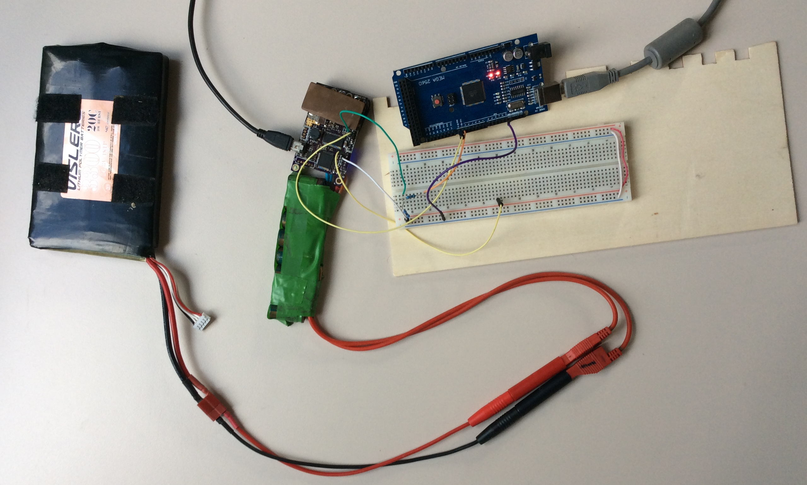
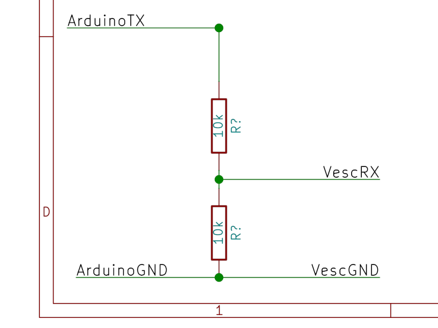
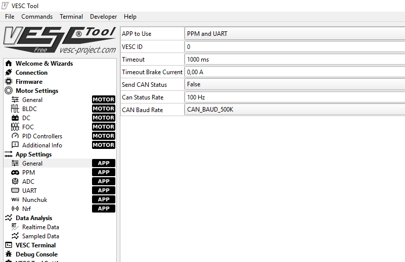
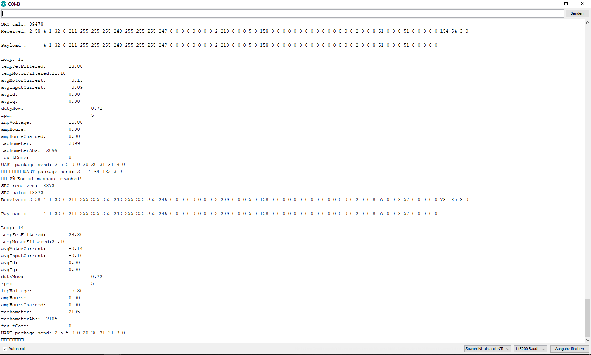

Example project on how to control and monitor a Vesc ESC via a serial connection
=============

## Library origin

This is almost entirely a copy of https://github.com/RollingGecko/VescUartControl/tree/VESC6 .
Everything here is only minimized in order to create a small example which can be run out of the box.
The original [licencse](LICENSE.md) can be applied here, too.

## Code origin

There are [original code comments and source descriptions](codeandsourcedescription.md) about how this project was developed.

## How to use this repository

This is a quick out of the box configuration for an Arduino (I used the Mega 2560 variant) to communicate with the Vesc via UART. I tested this with VescTool 0.91 and firmware 3.37 on a Vesc 4.12. This should work with at least any VescTool firmware and Vesc 4.12 and 6.x.

### Hardware setup

This is an image of the minimal hardware setup using my experimental Vesc 4.12 PCB and an Arduino Mega 2560.

This is a Vesc connected to the PC via USB (to monitor the results) and an Arduino. The connection is a basic serial connection. The Vesc expects 115200 (8N1). To communticate via a serial connection the TX (transmitting pin) of one device has to be connected to the RX (receiving pin) of the other device. The same connection has to be made for the other direction. Both devices need a common ground, i.e. connect both GND pins.
An Arduino is commonly a 5V device. The vesc processor runs on 3.3V. A straight connection 
GND-->GND
ArduinoTX-->VescRX
VescTX-->ArduinoRX
can be made as the USART Pins on the processor of the Vesc are 5V tolerant. (The [Vesc 6.4 schematic](https://vesc-project.com/sites/default/files/Benjamin%20Posts/VESC_6.pdf) and the [Vesc 4.12 schematic](https://github.com/vedderb/bldc-hardware) use PB10 (RX) and PB11(TX) as Uart connections. Those pins are accorting to the [511-STM32F405RGT6 processor's datasheet](https://www.mouser.de/datasheet/2/389/stm32f405rg-956214.pdf) 5V tolerant.
I did not research this at first and used a voltage divider in the ArduinoTX--voltage divider--VescRX connection.) This is a simple divide by 2 voltage divider with two 10kOhm resisitors according to the schematic. This drops the on signal voltage on the line from 5 to 2.5V for the Vesc. Those 2.5V are within the specs of the vesc processor and recognised as high value. The Arduino recognises a high value (3.3V) from the vesc as high, too.
Be careful with this connection as high current connections close to the signal lines can induce destructive voltages and damage your setup. I used shielded cables. Ground loops, i.e. a second gnd wire from your battery ground to your microcontroller gnd and on to your vesc can also have harmful effects. I did not test ground loop problems as I use an esp8266/Arduino only connected to the vesc for logging and control now.
If you use Serial in Arduino (not Serial0,...,2) you use the same connection as the programmer from the arduino IDE. It can be necessary to disconnect the RX pin on the Arduino for programming while the Vesc is connected and running.
Here is a quick and dirty schematic:

You can add a series resistor of 1k in the line from VescTX--1kOhm--ArduinoRX. This should prevent the vesc from backpowering the Arduino through this pin. This can lead to an instable connection.

### Software setup

You can clone this repo by clicking "Clone or download" above and downloading the files as zip for example.
Unzip this file on your PC. I tested this with Arduino 1.8.5 / Ardunio Mega 2560. Connect everything according to the hardware setup.
Connect to the Vesc with a USB cable and the VescTool. Read the App configuration and set the app to PPM and Uart. My settings are in the image below:

Write the App configuration. It might be necessary to reset the Vesc now by cycling the power.
You can enable realtime monitoring and switch to the corresponding panel on the VescTool to see the changes you make with your arduino.
In VescTool and the Arduino IDE make sure the right serial port is selected.
WARNING: This Arduino Sketch instantly sets the DutyCycle of the Vesc to 5.15%. Any connected motor will start moving instantly. You can see this in the Vesctool even with now motor connected.
Use the serial monitor in the Ardunio IDE to watch the values read from your Vesc.
Example here:

### How to use this in your project

Copy all necessary files from this example to your project.
Change the Serial ports used to the ones your hardware is connected to. This is in "config.h".
You might want to disable the debug output via serial, both in this code and your own to avoid any chatter on the serial connection.
You can look at all the funcions provided in "VescUart.h". After initalization you can use any of the to monitor or contorl your vesc.

